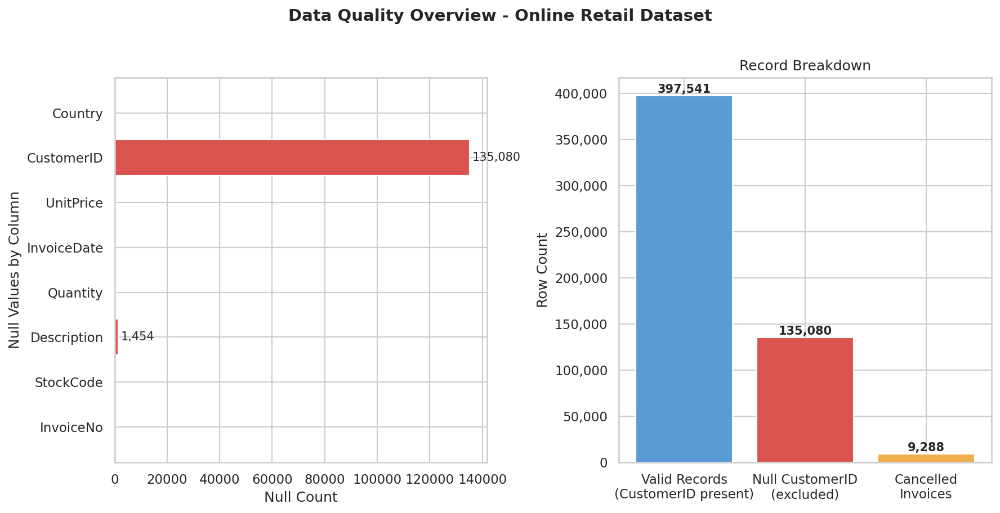
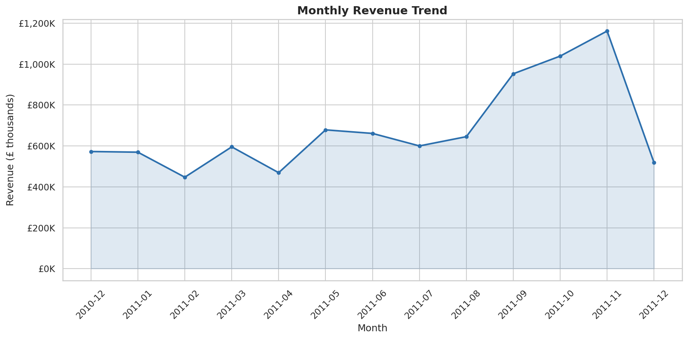
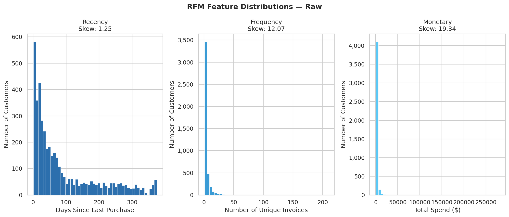
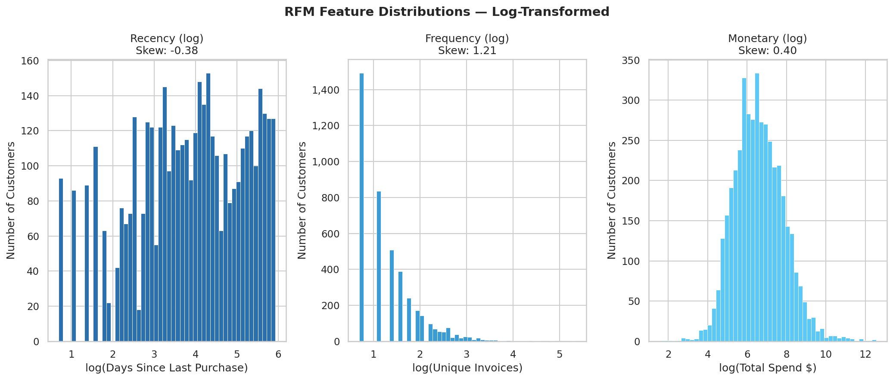
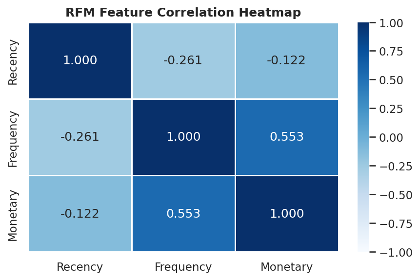
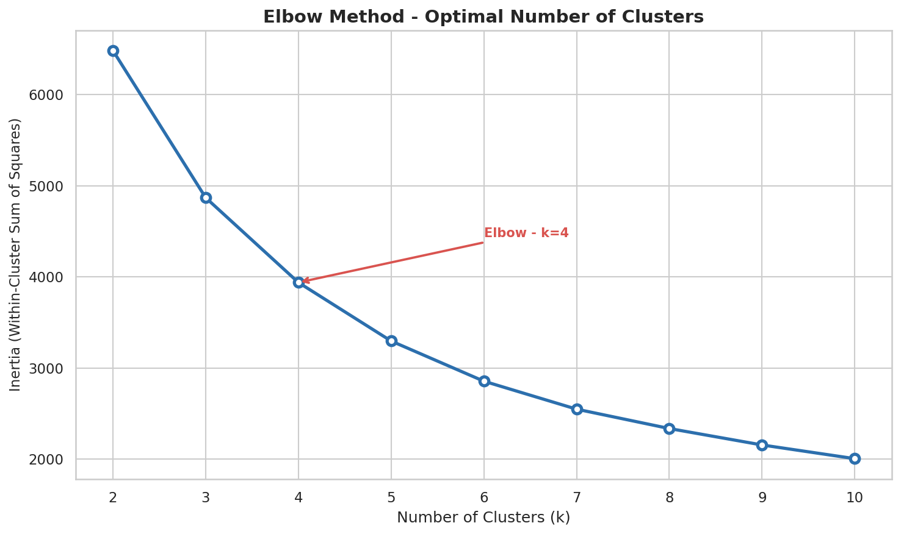
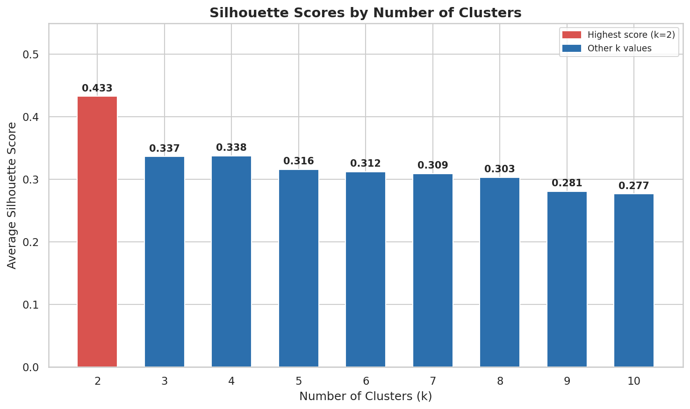
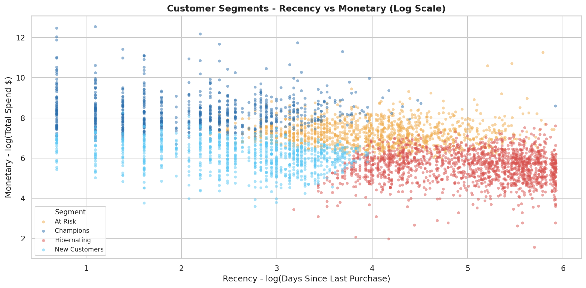
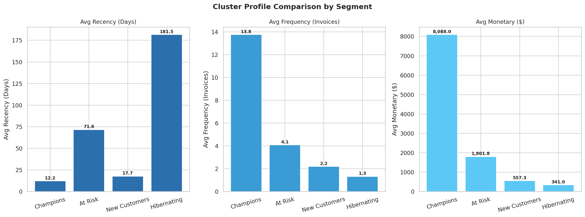
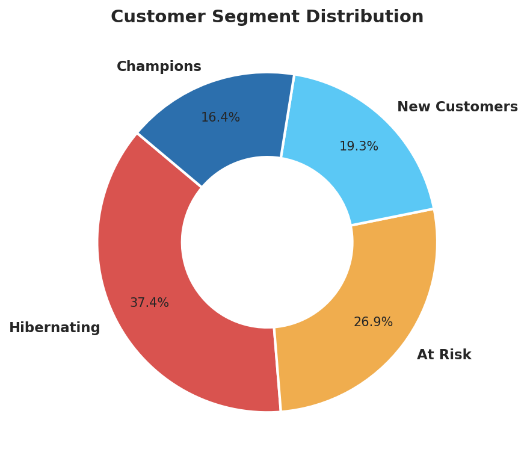

# :bar_chart: Customer Segmentation - K-Means Clustering Analysis

> **Which customer segments exist within out retail base, and what behaviors define high-value versus at-risk customers?**\
> This project uses Python, PostgreSQL and K-Means Clustering to find out.

---

## :card_index_dividers: Table of Contents
- [Project Overview](#project-overview)
- [Tools & Technologies](#tools--technologies)
- [Dataset](#dataset)
- [Project Structure](#project-structure)
- [Key Findings](#key-findings)
- [Visualizations](#visualizations)
- [Business Recommendations](#business-recommendation)
- [How to Reproduce](#how-to-reproduce)
- [Author](#author)

---

## :mag_right: Project Overview

Customer segmentation is one of the most valuable and widely-applied technique in retail analytics. This project conducts a full unsupervised machine learning analysis of the UCI Online Retail Dataset using **PostgreSQL** for structured querying and **Python** for RFM feature engineering, K-Means clustering and visualization - moving beyond transactional summaries to identify distinct, actionable customer segments with clear behavioral profiles.

The analysis is structured across three notebooks:
1. Data loading, PostgreSQL ingestion and structural EDA - shape, nulls, duplicates and cancellation patterns.
2. RFM feature engineering - Recency, Frequency and Monetary computation per customer, distribution analysis and log transformation.
3. K-Means clustering - feature scaling, Elbow method, Silhouette scoring, optimal k selection, segment labelling and profile visualization.

---

## :wrench: Tools & Technologies

| Tool | Purpose |
|------|---------|
| PostgreSQL | Database storage across three tables - online_retail, rfm_scores, rfm_segments |
| DVBeaver | PostgreSQL GUI and SQL query execution |
| Python (Pandas, Numpy) | Data loading, cleaning and RFM feature engineering |
| Python (Scikit-learn) | StandardScaler, KMeans, silhouette_score |
| Python (Matplotlib, Seaborn) | Data visualization - distributions, scatter, heatmap, donut |
| SQLAlchemy + psycopg2 | PostgreSQL - Python connection |
| Jupyter Notebook | Analysis narrative and presentation |
| Git / Github | Version control and project hosting |

---

## :clipboard: Dataset

**UCI Online Retail Dataset**\
Source: [UCI Machine Learning Repository](https://archive.ics.uci.edu/dataset/352/online+retail)

| Property | Value |
|----------|-------|
| Raw rows | 541,909 transactions |
| Columns | 8 - InvoiceNo, StockCode, Description, Quantity, InvoiceDate, UnitPrice, CustomerID, Country |
| Date Range | 1 December 2010 - 9 December 2011 |
| Countries | 38 |
| Clean Rows (post-filtering) | 392,692 |
| Customers in RFM Table | 4,338 |

**Key Variables Used:** CustomerID, InvoiceNo, InvoiceDate, Quantity, UnitPrice, Country

> **Note:** This is a real transactional dataset from a UK-based online retailer. Approximately 24.93% of rows have no CustomerID and are excluded from segmentation. Cancellation transactions (InvoiceNo prefixed with 'C') are excluded as reversals, not purchases.

---

## :pushpin: Project Structure

```
customer-segmentation/
|
├── data/
│   └── Online-Retail.xlsx              # Raw dataset
|
├── sql/
│   └── 01_rfm_queries.sql              # 10 analytical queries across 3 PostgreSQL tables
|
├── notebooks/
│   ├── 01_load_and_explore.ipynb       # Data loading, PostgreSQL push, structural EDA
│   ├── 02_rfm_engineering.ipynb        # RFM feature engineering, distributions, log transform
│   └── 03_kmeans_segmentation.ipynb    # Scaling, elbow, silhouette, K-Means, segment profiles
|
├── visualizations/
│   ├── 01_data_quality_overview.png
│   ├── 02_monthly_revenue_trend.png
│   ├── 03_rfm_distributions_raw.png
│   ├── 04_rfm_distributions_log.png
│   ├── 05_rfm_correlation_heatmap.png
│   ├── 06_elbow_curve.png
│   ├── 07_silhouette_scores.png
│   ├── 08_scatter_recency_monetary.png
│   ├── 09_cluster_profile_bars.png
│   └── 10_segment_donut
|
├── README.md
└── requirements.txt
```

---

## :closed_book: Key Findings

### 1. :red_circle: Champions Represent 16.4% of Customers but Generate 64.9% of Revenue

| Segment | Customers | Share | Avg Recency | Avg Frequency | Avg Monetary | Revenue Share |
|---------|-----------|-------|-------------|---------------|--------------|---------------|
| Champions | 713 | 16.4% | 12 days | 13.75 invoices | $8,088 | **64.9%** |
| At Risk | 1,166 | 26.9% | 72 days | 4.08 invoices | $1,802 | 23.6% |
| New Customers | 837 | 19.3% | 18 days | 2.19 invoices | $557 | 5.2% |
| Hibernating | 1,622 | 37.4% | 182 days | 1.32 invoices | $341 | 6.2% |

Champions but every 12 days on average, across 13+ unique invoices, and spend $8,088 in total - making them the single most critical group to protect. Their disproportionate revenue contribution ($5,766,757 of $8,887,209 total) means losing even a small number of Champions has an outsized impact on business revenue.

---

### 2. :red_circle: Hibernating Customers are the Largest Segment at 37.4% - and Almost Entirely Disengaged

With 1,622 customers averaging 182 days since their last purchase and only 1.32 invoices in total, the Hibernating segment represents the largest single group in the customer base but generates only 6.2% of revenue ($341 average spend). These customers have not purchased in approximately six months and have minimal historical engagement - the window for re-activation is closing. A targeted win-back campaign is warranted before they churn permanently.

---

### 3. :red_circle: At-Risk Customers are the Highest-Priority Retention Target

At Risk customers (1,166 customers, 26.9%) show clear signs of previous engagement - 4.08 invoices and $1,802 average spend - but recency has slipped to 72 days. This is the segment where retention investment has the highest expected return: they have demonstrated willingness to purchase repeatedly and spend meaningfully, but are showing early disengagement. Their collective revenue of $2,100,873 represents 23.6% of total segmented revenue - directly at risk of being lost.

---

### 4. :red_circle: New Customers Buy Recently but Remain Low-Frequency

New Customers (837 customers, 19.3%) purchased within the last 18 days on average, indicating genuine recent activity, but average only 2.19 invoices and $557 total spend. They have entered the customer base but have not yet converted to repeat buyers. Without deliberate nurturing - onboarding communications, personalized product recommendations or loyalty incentives - a proportion of this group will drift toward Hibernating rather than toward Champions.

---

### 5. :red_circle: Revenue is Highly Concentrated - Top Market and Peak Season Identified

The United Kingdom dominates revenue at $7,285,024, representing the vast majority of total clean-data revenue. November 2011 was the peak month at $1,156,205 - consistent with pre-Christmas retail demand. February 2011 was the weakest month at $446,084. Australia had the highest cancellation rate at 5.88%, followed by Germany at 4.77%, against the UK baseline of 1.59%.

---

### 6. :red_circle: Frequency and Monetary are Moderately Correlated - Recency is Independent

| Pair | Correlation | Interpretation |
|------|-------------|----------------|
| Frequency - Monetary | **0.553** | Customers who buy more often also spend more in total. |
| Recency - Frequency | -0.261 | More recent customers tend to purchase more frequently. |
| Recency - Monetary | -0.122 | Recency and total spend are largely independent. |

No two RFM features are sufficiently correlated to make one redundant. All three contribute independent information to the clustering model, validating the RFM framework as an appropriate feature set for this dataset.

---

## :chart_with_upwards_trend: Visualizations

### Data Quality Overview


### Monthly Revenue Trend


### RFM Distributions - Raw


### RFM Distributions - Log-Transformed


### RFM Correlation Heatmap


### Elbow Curve


### Silhouette Scores


### Cluster Scatter - Recency vs Monetary


### Cluster Profile Comparison


### Customer Segment Distribution


---

## :bulb: Business Recommendations

### Recommendation 1 - Protect and Reward Champions *(Priority: Critical)*
Champions generate 64.9% of revenue from just 16.4% of customers. A dedicated VIP programme - early access to new products, loyalty rewards, exclusive discounts - should be implemented immediately to reduce churn risk in this group. The cost of acquiring a replacement Champion far exceeds the cost of retaining an existing one. Even a 5% improvement in Champions retention would have a measurable impact on total revenue.

### Recommendation 2 - Launch a Targeted At-Risk Retention Campaign *(Priority: Critical)*
At Risk customers have demonstrated clear purchase intent (4+ invoices, $1,802 average spend) but are lapsing at 72 days recency. A personalized re-engagement campaign - triggered at the 45-day mark of inactivity, featuring product recommendations based on purchase history and a time-limited incentive - has the highest expected return on investment of any segment intervention. Recovering even 20% of At Risk customers to active status would preserve over $420,000 in revenue.

### Recommendation 3 - Implement a New Customer Nurture Sequence *(Priority: High)*
New Customers have purchased recently but average only 2.19 invoices. A structured onboarding sequence - welcome communication, curated second-purchase recommendation and a loyalty milestone at invoice 3 - would accelerate their progression toward the At Risk and Champions profiles. Without deliberate nurturing, a proportion of New Customers will drift toward Hibernating within 60-90 days.

### Recommendation 4 - Run a Time-Limited Win-Back Campaign for Hibernating Customers *(Priority: High)*
With 1,622 customers averaging 182 days of inactivity and only 1.32 invoices, the Hibernating segment requires a clear-cut stimulus to re-engage. A win-back campaign with a meaningful incentive (e.g. a percentage discount valid for 30 days) should be deployed. Response rate expectations should be set conservatively - even a 10% re-activation rate would recover 162 customers and approximately $55,000 in revenue. Customers who do not respond should be deprioritized in future marketing spend.

### Recommendation 5 - Investigate Elevated Cancellation Rates in Australia and Germany *(Priority: Medium)*
Australia (5.88%) and Germany (4.77%) show cancellation rates significantly above the UK baseline (1.59%). Elevated cancellations indicate fulfillment  issues, product-expectation mismatches or logistics delays in these markets. A targeted review of cancellation reasons in these two countries - cross-referenced with shipping time and product categories - should be conducted before increasing marketing investment in either market.

---

## :computer: How to Reproduce

### Prerequisites
- PostgreSQL 15+ installed and running
- DBeaver or pgAdmin installed
- Python 3.8+ with the following packages:

```bash
pip install pandas numpy matplotlib seaborn sckikit-learn sqlalchemy psycopg2-binary openpyxl jupyterlab
```

### Steps

**1. Clone the repository:**
```bash
git clone https://github.com/shailendragadakari/Customer-Segmentation.git
cd Customer-Segmentation
```

**2. Set up the Database:**
- Open DBeaver and connect to your local PostgreSQL instance.
- Create a new database called 'retail_segmentation'.
```sql
CREATE DATABASE retail_segmentation;
```

**3. Place the Dataset:**
- Download 'Online-Retail.xlsx' from the UCI ML Repository or Kaggle.
- Place it in the 'data/' folder.

**4. Run the Jupyter Notebooks in order:**
```bash
jupyter notebook
```

- Run '01_load_and_explore.ipynb' - loads the data and pushes 'online_retail' table to PostgreSQL.
- Run '02_rfm_engineering.ipynb' - engineers RFM features and pushes 'rfm_scores' table to PostgreSQL.
- Run '03_kmeans_segmentation.ipynb' - fits K-Means and pushes 'rfm_segments' table to PostgreSQL.
- Update the PostgreSQL connection string in each notebook if your credentials differ from the existing.

**5. Verify the pipeline:**
```sql
SELECT COUNT(*) FROM online_retail;     -- Expected: 541,909
SELECT COUNT(*) FROM rfm_scores;        -- Expected: 4,338
SELECT "Segment", COUNT(*) FROM rfm_segments GROUP BY "Segment" ORDER BY COUNT(*) DESC;     -- Expected: | Hibernating 1622. | At Risk 1166 | New Customers 837 | Champions 713 |
```

**6. Run the SQL queries:**
- Open 'sql/01_rfm_queries.sql' in DBeaver.
- Execute all 10 queries against the 'retail_segmentation' database.

---

## :bust_in_silhouette: Author

**Shailendra Gadakari**\
B.E. Computer Science - BITS Pilani\
IBM Data Science Professional Certificate\
Microsoft Power BI Data Analyst Professional Certificate

:email: shailendragdk2701@gmail.com\
:link: [LinkedIn](https://www.linkedin.com/in/shailendra-gadakari-b0a465332/)\
:octopus: [Github](https://github.com/shailendragadakari)\
:round_pushpin: Doha, Qatar


